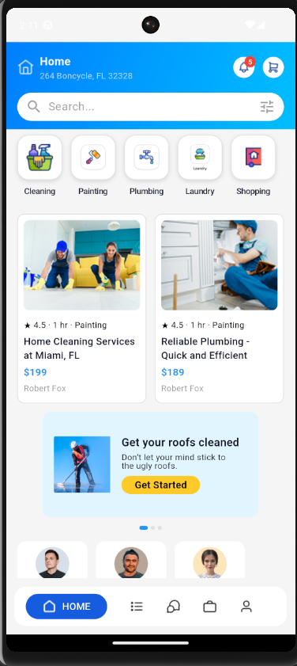
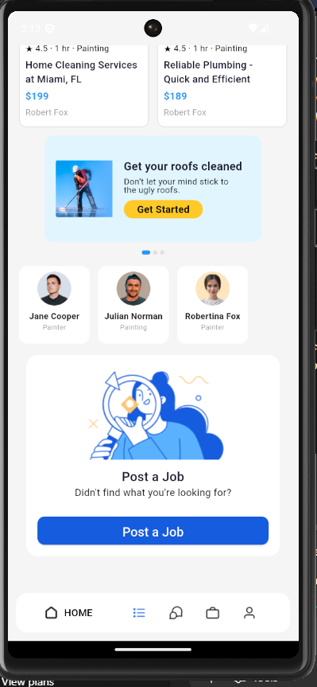

# test_app
# 🏠 Home Services App (`test_app`)

A visually rich and user-friendly Flutter application that allows users to find and book home services such as cleaning, plumbing, laundry, painting, and more.

---

## 🚀 Features

- 🔵 Seamless gradient top bar with location, notification, and cart access
- 🔍 Smooth search bar with filter
- 🧹 Categorized service types with icons
- 🛠️ Service cards with ratings, pricing, and provider names
- 📢 Promotional banners
- 👩‍🔧 Horizontally scrollable list of service providers
- 📨 Post a job section
- 📱 Custom bottom navigation bar with active highlight

---

## 📸 Screenshots

### 🔼 Main View


### 🔽 Bottom Section


---

## 📦 Project Structure

```
test_app/
├── assets/
│   └── images/
│       ├── [All your image assets here...]
├── lib/
│   └── main.dart
├── pubspec.yaml
```

---

## ⚙️ Setup Instructions

1. **Clone the Repository**

```bash
git clone https://github.com/yourusername/test_app.git
cd test_app
```

2. **Install Dependencies**

```bash
flutter pub get
```

3. **Run the App**

```bash
flutter run
```

4. **Verify Assets in `pubspec.yaml`**

Ensure the following block is present:

```yaml
flutter:
  assets:
    - assets/images/
```

---

## 📝 Notes

- Static service & provider data; ideal for Firebase/REST API integration in future
- Basic state management using `setState`
- UI optimized for mobile using `SingleChildScrollView` and clean layout widgets

---

## 📌 Future Enhancements

- [ ] Dynamic screen navigation based on bottom nav
- [ ] Add Firebase authentication and Firestore integration
- [ ] Improved state management using Provider or Riverpod
- [ ] Responsive layout support for tablets and web


> Built with using Flutter by [Subrato]
